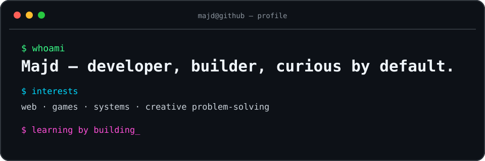

<p align="center">
  
</p>

## About me

I’m a developer who learns by making things. I enjoy moving between web experiences, game ideas, low-level programming, and the small details that make a project click. I’m most at home when I’m exploring, building, and figuring out how something works.

## Toolbox

```text
Web        JavaScript · TypeScript · CSS
Games      Unity · Godot · GDScript
Systems    C · C++ · C# · Shell
Scripting  Python
```

## Mindset

> Build the idea. Learn the why. Improve the next version.

I’m always looking for interesting problems, new tools to understand, and projects that are useful, playful, or a little bit challenging.
